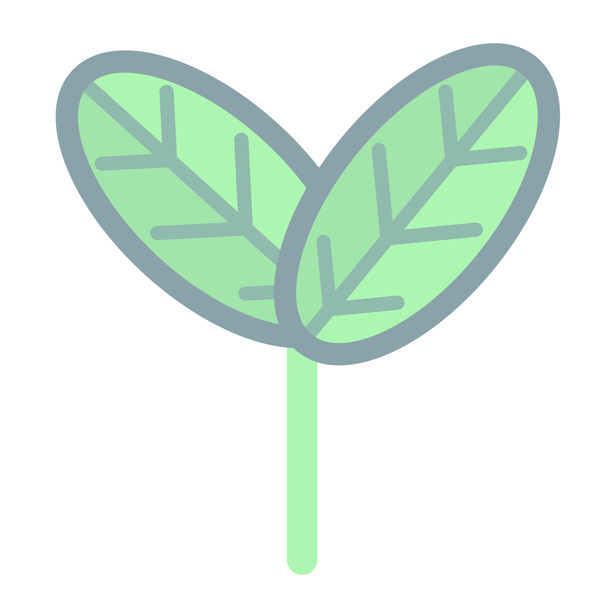
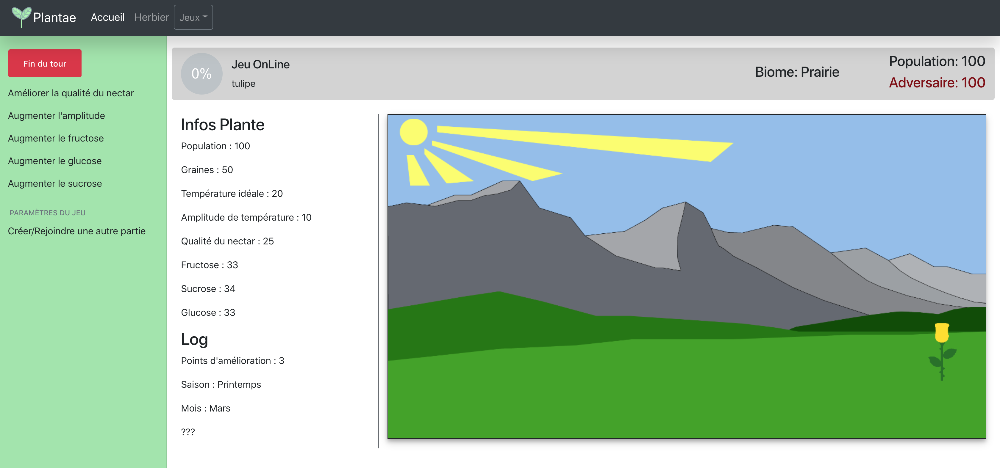
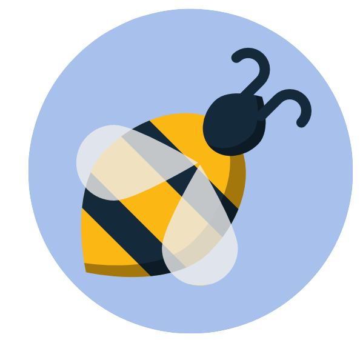
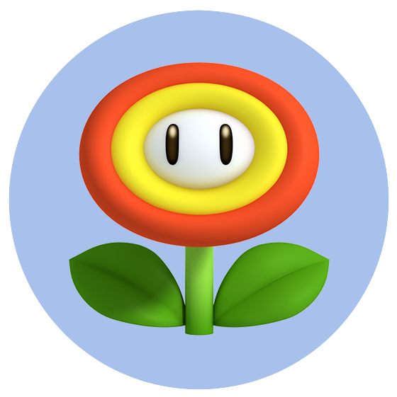

# Plantae

## Présentation

Sur ce jeu à rôle éducatif au tour par tour, vous apprendrez à vous occuper d'une plante qui puisse résister à n'importe quel environnement.

## Comment accéder au site ?

Rendez-vous sur [Plantae](https://plantae.princelle.org) pour jouer !

<small>Notre site fonctionne avec la plupart des navigateurs actuels mais nécessite JavaScript. <br>L’utilisation d’un navigateur comme Internet Explorer ou trop ancien peut poser problème</small>

## Membres du groupe

* [PRINCELLE Maxime](https://princelle.org)
* [LEHMANN Loïc](https://git.unistra.fr/l.lehmann)
* [DIYAN Guil](https://git.unistra.fr/gdiyan)

## Screenshots

### Mode Solo


### Mode OnLine


## Fichiers de gestion de projet
[Lien vers Google Drive](https://share.princelle.org/gestion-projet-t3)


-----------------
## Plusieurs modes de jeu

De nombreux modes de jeu vous permettent de jouer seul contre votre ordinateur ou avec vos amis en local ou en ligne.

#### Solo

 <br>
Le mode solo vous permet de jouer face à l'ordinateur.
Le but est simple : avoir la plus grande population

#### OnSite

 <br>
Le mode OnSite vous permet de jouer contre un ami sur un même ordinateur.
Le jeu prends fin lorsque l'un des joueurs meurt.

#### Online

 <br>
Ce mode de jeu vous permet de jouer avec un ami via Internet.
Le jeu prends fin lorsque l'un des joueurs meurt.
Creez ou rejoignez une partie pour jouer.

#### Quizz

 <br>
Dans ce mode de jeu vous sera posé des questions (QCM) sur certains thèmes de la botanique (pollinisation...).
Répondez juste et améliorez vos connaissances afin d'être plus efficace dans les autres modes.


-----------------
## Apport scientifique

### Pollinisation

 <br>

Nous avons étudié l’impact des abeilles en fonction de l’environnement mais également du type de fleur qu’elles butinent.

Nous avons donc ajouté a notre IA la capacité de simuler l’activité des abeilles et donc d’intéragir sur la reproduction de la fleur ainsi que sur sa santé.


### Saisons


Il est possible de changer le biome dans lequel votre plante va évoluer.

En effet, ce dernier joue un rôle important dans le développement de la fleur mais agit également sur les pollinisateurs (abeilles) et donc indirectement sur la reproduction de la fleur.

Il sera important de choisir la bonne fleur avec des caractéristiques qui lui permetteront de tenir peu importe l’environnement.

### Météo


Comme vous pouvez choisr le biome, notre IA pourra changer les paramètres de votre environnement en cours de partie, en plaçant, par exemple, un temps pluvieux, ensoleillé, mais cette dernière pourra aussi jouer sur la température en rendant votre biome sec, humide ou même hivernal.

Des événèments seront également déclenchés de manière aléatoire tels qu’un orage, du vent puissant, ou de la pluie forte.

### Fleur



Comme dit précedemment, choisir sa fleur est une étape primor- diale qui peut vous mener à la victoire.

En choisissant les meilleures caractéristiques vous pouvez plus ou moins aisément battre votre adversaire rien qu’avec votre sélection sans même utiliser vos points.

### Points


En cours de partie vous recevrez des points qui pourront être utilisés afin de déculper les capacités de votre fleur.

De ce fait, vous pourrez prendre l'avantage sur votre adversaire selon les points que vous aurez choisis.

Vous pourrez ainsi améliorer votre nectar, ou l'amplitude de température idéale pour votre plante.

## Moyens techniques

### Interface


 <br>

L’interface repose sur du Web.

Cette méthode permet à notre jeu de fonctionner sur toutes les plateformes possibles sans installation requise.

Afin d’avoir une interface qui soit la plus uniforme possible, nous avons utilisé des librairies telles que Bootstrap, Angular en passant par JQuery.

Toutes ces libraries ont l’avantage d’être compatibles avec la plupart des navigateurs, garantissant ainsi le multi-plateforme.

### Moteur


Pour le moteur du jeu nous utilisons la librairie Ratchet qui permet la création de WebSockets.

Ainsi, tout le moteur est codé en PHP, mais également les différentes connexions à la base de donnée que ce soit pour la gestion des utilisateurs mais aussi la gestion des fleurs et des biomes.


### Base de données


Afin d’être en accord avec ce que nous avons étudié jusqu’à présent avec les bases de données, nous avons utilisé phpMyAdmin basé sur MySQL qui nous permet facilement de gérer nos différentes données (Utilisateurs, Fleurs,...).

De plus, il s’agit de l’outil le plus utilisé dans ce domaine.

-----------------
## Installation / Mise en place

### Pré-requis
* Un ordinateur sous Windows, Linux ou MacOS
* Un logiciel pour vous connecter en Bureau à distance <br><small>(Microsoft Remote Desktop ou Connexion Bureau à Distance)</small>

### Procédure

1. Connectez vous au serveur "Phoenix" de Unistra, c'est à partir de ce dernier que vous lancerez le site. <br><small>Vous pouvez vous connecter en connexion à distance (recommandé) ou sur un ordinateur de l'IUT</small><br><small>Le serveur "Phoenix" est disponible à l'adresse : [phoenix.iutrs.unistra.fr](phoenix.iutrs.unistra.fr)</small>.

2. Créez un nouveau dossier pour le site dans votre répertoire.

3. Ouvrez un terminal/invite de commande.

4. Une fois le dossier créé, rendez-vous à ce dernier à l'aide de la commande (CD), et lancez la commande : <br>```git clone https://git.unistra.fr/T432-DIP18-T3-A/plantae.git``` <br> Insérez vos identifiants Unistra s'ils sont demandés.

<br>Si cela ne fonctionne pas, essayez cette commande<br>```git clone https://github.com/ThePrinceMax/Plantae.git```

5. Entrez la commande suivante : <br>```cd plantae/public/src/plantae/```

6. Ensuite entrez cette commande : <br>```php -S localhost:8000```

7. Pour continuer, ouvrez un deuxième terminal/invite de commande sur le dossier que vous avez créé et entrez cette commande : <br>```cd plantae/```

8. Maintenant, toujours dans le deuxième terminal/invite de commande, lancez la commande : <br>```php ./public/bin/GamesManager-server.php```

9. Vous pouvez maintenant jouer au jeu. En vous connectant au site à l'adresse : [localhost:8000](http://localhost:8000)<br><small>(Le mode multijoueur via le réseau ne fonctionnera pas, si vous souhaitez jouer à plusieurs, ouvrez deux navigateurs sur la même session).</small>

10. Si vous souhaitez fermer le jeu, fermez tout simplement les deux terminaux ou invite de commande.

PS : Si jamais vous rencontrez un problème contactez moi au [06.29.24.93.52](tel:+33629249352) ou par mail à l'adresse [maxime@princelle.org](mailto:maxime@princelle.org).

PS : PS : Si jamais, le site, déjà configuré, est disponible à cette adresse : [plantae.princelle.org](https://plantae.princelle.org/)

-----------------
## Affiche

