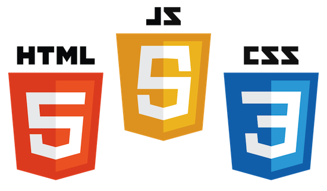

# Plantae

## Présentation 

Sur ce jeu à rôle éducatif au tour par tour, vous apprendrez à vous occuper d'une plante qui puisse résister à n'importe quel environnement.

## Comment accéder au site ?

Rendez-vous sur [Plantae](https://plantae.princelle.org) pour jouer !
(Un navigateur trop ancien peut poser problème (aka. IE))

## Membres du groupe : 

PRINCELLE Maxime
LEHMANN Loïc 
DIYAN Guil

## Plusieurs modes de jeu

De nombreux modes de jeu vous permettent de jouer seul contre votre ordinateur ou avec vos amis en local ou en ligne.

#### Solo

  
Le mode solo vous permet de jouer face à l'ordinateur.
Le but est simple : avoir la plus grande population

#### OnSite

  
Le mode OnSite vous permet de jouer contre un ami sur un même ordinateur.
Le jeu prends fin lorsque l'un des joueurs meurt.

#### Online

  
Ce mode de jeu vous permet de jouer avec un ami via Internet.
Le jeu prends fin lorsque l'un des joueurs meurt.
Creez ou rejoignez une partie pour jouer.

#### Quizz

  
Dans ce mode de jeu vous sera posé des questions (QCM) sur certains thèmes de la botanique (pollinisation...).
Répondez juste et améliorez vos connaissances afin d'être plus efficace dans les autres modes.

## Apport scientifique : Qu'est ce-que Plantae apporte ?

#### Pollinisation 

  

Nous avons étudié l'impact des abeilles selon l'environnement et le type des fleurs qu'elles butinent. 
Nous avons donc ajouté à notre IA la capacité de simuler l'activité des abeilles.

#### Biome

  

Il est possible de modifier le biome où votre plante evoluera. 
En effet ce dernier joue un rôle important dans le developement de la fleur (temperature, pollinisateurs...).
Le biome pourra être changé par l'IA en cours de partie, jouant sur la meteo, la temperature...

#### Système de points

  

En cours de partie vous recevrez des points qui pourront être utilisés afin de déculper les capacités de votre fleur.
De ce fait, vous pourrez prendre l'avantage sur votre adversaire selon les points que vous aurez choisis.
Vous pourrez ainsi améliorer votre nectar, ou l'amplitude de température idéale pour votre plante.

## Interface

  

L'interface repose sur du Web, ceci permettant à notre de jeu de fonctionner sur la plupart des plateformes et ce sans installation préalable.
Afin de rendre notre interface le plus uniforme, nous avons utilisés des librairies telles que Bootstrap, et Angular en passant par JQuery.
Toutes ces librairies ont l'avantage d'être compatibles avec la majorité des navigateurs, garantissant le multi-plateforme.

## Moteur

  

Concernant le moteur de jeu, nous utilisons la librairie Ratchet afin de créer les Websockets.
Ainsi le moteur de jeu est codé en PHP mais également les différentes connexions a la base de données et la gestion des fleurs et des biomes.

## Base de données
  

Afin d’être en accord avec ce que nous avons étudié jusqu’à présent avec les bases de données, nous avons utilisé phpMyAdmin basé sur MySQL qui nous permet facilement de gérer nos différentes données (Utilisateurs, Fleurs,...).
De plus, il s’agit de l’outil le plus utilisé dans ce domaine.
